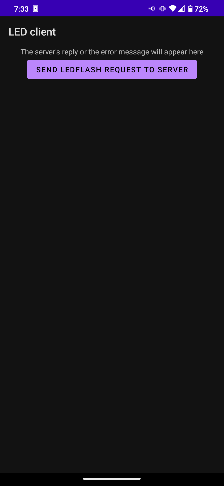

# READ THIS!!!
You need to add the server IP and port in app/src/main/cpp/native-lib.cpp before you can use the app!!

# Importing into Android Studio
Download the code in a zip file, open Android Studio, go to File -> New -> Import Project, then choose the specific project you want to import and then click Next->Finish. 
